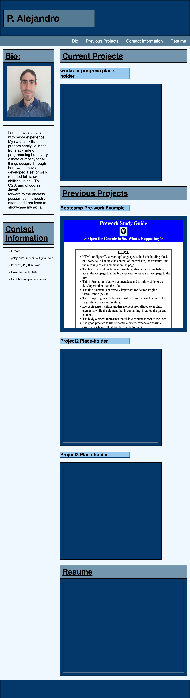

# Portfolio-HTML-CSS

## Description
 Motivation: I will ultimately need a place to store samples of my previous work as a developer. This mockup of my first portfolio will allow employers and co-workers acess all of my completed projects in one place.

Reason: My reasoning behind created this app, was to practice my newly learned HTML, and CSS knowledge in a real-world applicable way. This portfolio will be revised throughout the course of the bootcamp until it will hopefully catch the eye of an employer. 

Content Learned: I learned how to start a project from scratch and build a very simple webpage that will serve as my future portfolio. 

## Images and Screenshots

## Link to Deployed App.

[GitHub Link](https://p-alejandrojimenez.github.io/Portfolio-HTML-CSS/)